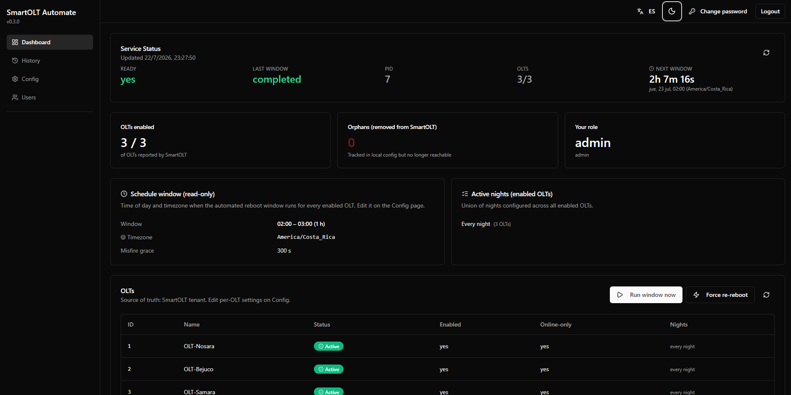

# SmartOLT Automate Installer

One-command installer for [SmartOLT Automate](https://github.com/asotonet/smartolt-automate). The script pulls prebuilt Docker images, generates `.env`, validates the config, and brings the stack online.

This repo is public and contains no application source — the images come from Docker Hub. Full source lives in the [upstream project](https://github.com/asotonet/smartolt-automate).

<p align="center">
  
</p>

## Quick start

```bash
git clone https://github.com/asotonet/smartolt-automate-installer
cd smartolt-automate-installer
cp .env.example .env
$EDITOR .env          # set SMARTOLT_DEPLOY_PROFILE, domain (if any), admin password
./smartolt.sh install --yes
```

The first run prints the auto-generated admin password at the end (if you didn't set `INITIAL_ADMIN_PASSWORD` in `.env`). Save it before closing the shell.

After install:

- `./smartolt.sh status` — container health
- `./smartolt.sh logs` — tail logs of all services
- `./smartolt.sh deploy` — re-apply after editing `.env` (image pins, profile, domain, scheduler window)
- `./smartolt.sh destroy` — nuke everything the installer created

## Deploy profiles

The single knob is `SMARTOLT_DEPLOY_PROFILE` in `.env`. It controls three things: how the frontend is exposed, whether Traefik runs, and where HTTPS comes from.

| Profile | Frontend on host | Traefik | HTTPS | Use when |
|---|---|---|---|---|
| `lan` (default) | `:8080` on `0.0.0.0` | runs but doesn't route | self-signed `:443` | LAN testing |
| `https-public` | loopback `:8080` | runs, routes by labels | Let's Encrypt via ACME HTTP-01 | Production with a public domain |
| `https-behind-external-proxy` | loopback `:8080` | **doesn't run** | handled by your external proxy | Cloudflare Tunnel / Caddy / nginx in front of the host |
| `frontend-only` | `:8080` on `0.0.0.0` | **doesn't run** | none | Lowest footprint; LAN only, no HTTPS |

If `SMARTOLT_DEPLOY_PROFILE` is empty in `.env`, the install wizard infers: `SMARTOLT_PUBLIC_DOMAIN` set → `https-public`, otherwise `lan`.

The wizard handles everything from there. See [`.env.example`](.env.example) for the full list of knobs.

For `https-behind-external-proxy`, point your external proxy at `http://127.0.0.1:8080`:

```caddyfile
# /etc/caddy/Caddyfile
panel.example.com {
    reverse_proxy 127.0.0.1:8080
}
```

## Changing the profile after install

Edit `SMARTOLT_DEPLOY_PROFILE` in `.env` and run `./smartolt.sh deploy`. The deploy command handles the cross-profile transition automatically: if a Traefik container exists from a previous profile and the new one skips it, the deploy removes the orphan first so you don't end up with a Traefik running on `:80`/`:443` when the active profile says it shouldn't.

## What the script does

`./smartolt.sh install --yes` walks the wizard (or skips prompts in non-interactive mode), then:

1. Verifies `docker` + `docker compose` are present.
2. Bootstraps `.env` from `.env.example` if missing.
3. Asks (or infers) the deploy profile.
4. Asks for admin credentials and the SmartOLT tenant URL/key (or reads from env).
5. Asks the scheduler window (timezone + hour range).
6. If the profile needs HTTPS, asks for the public domain and ACME email.
7. Validates every required var for the chosen profile (with type, description, and copy-paste example for missing/malformed values).
8. Writes `.env`, runs `docker compose pull` + `up -d`, and probes the healthcheck.

The wizard re-asks the profile with confirmation + retry if you mistype — no more silent typos landing you in the wrong mode.

## Day-to-day

```bash
./smartolt.sh status         # container health + profile + healthcheck URLs
./smartolt.sh logs           # tail all services
./smartolt.sh logs web       # tail one service
./smartolt.sh deploy         # re-apply after editing .env
./smartolt.sh upgrade        # pull new images at the version in .env
./smartolt.sh upgrade v0.5.0 # upgrade to a specific tag
./smartolt.sh destroy -y     # remove everything the installer created
```

Common flags:

- `-y, / --yes` — skip confirmation prompts (`install`, `destroy`, `upgrade`)
- `--dry-run` — print the plan without changing anything
- `--keep-images` / `--keep-data` (`destroy` only)

## Configuration

Everything lives in `.env`. Edit it and run `./smartolt.sh deploy` to apply.

The installer respects any image pin you set in `.env` (e.g. `PROXY_IMAGE=asoton/smartolt-automate-traefik:v0.4.10-traefik-fix`) across re-installs — the wizard won't clobber it with the default tag.

For advanced knobs (batching, JWT, internal API token, etc.) the install wizard writes sane defaults. Override per-host via a `docker-compose.override.yml` mounted on top of the service that owns it.

## Requirements

- Docker Engine 24+ with Compose v2
- 1 vCPU + 512 MB RAM available
- Outbound HTTPS (port 443) to `registry-1.docker.io`
- For HTTPS: ports 80 and 443 free on the host, a domain with an `A`/`AAAA` record pointing at the server

## Troubleshooting

| Symptom | Cause | Fix |
|---|---|---|
| `Profile '<name>' requires the following vars in .env that are missing or empty:` followed by a per-var block | The active profile needs vars that are empty or malformed in `.env`. The validator lists every missing var at once with its type, description, and a copy-paste example. | Edit `.env` and set the listed vars, then `./smartolt.sh deploy`. The validator catches: empty values, the `change-me-now` password sentinel, FQDNs without a dot or with whitespace, emails without `@` or `.`, images without `:tag`, passwords shorter than 8 characters. |
| Traefik logs `client version 1.24 is too old` on Ubuntu 24.04+ / Docker Engine 29+ | The bundled Traefik in `:v0.4.9` has a docker client pinned to API v1.24, which the modern daemon rejects. | Pin `PROXY_IMAGE=asoton/smartolt-automate-traefik:latest` in `.env` and `./smartolt.sh deploy`. The `:latest` tag ships Traefik 3.7+, which negotiates a modern API version. |
| Scheduler runs at the wrong hour after install | The wizard writes `SCHEDULER_TIMEZONE` to `.env`, but the core scheduler actually reads its timezone from the bind-mounted `configs/global.yaml`. | Edit `configs/global.yaml` to match `SCHEDULER_TIMEZONE`. The core hot-reloads it within ~2s. |
| Changed `SMARTOLT_DEPLOY_PROFILE` but Traefik container is still running | (Older versions only — current deploy handles this automatically by removing the orphan Traefik container before the new `up`.) | Run `./smartolt.sh deploy` — the deploy command detects the cross-profile transition. |
| `docker compose pull` reports `not found` for a tag that exists on Docker Hub | Stale registry cache. | Wait 5–10 minutes and retry, or pull manually (`docker pull asoton/smartolt-automate-traefik:latest`) before `./smartolt.sh deploy`. |
| Traefik container shows `unhealthy` on Windows + Docker Desktop | Traefik's `docker` provider can't read the Windows named pipe. | Expected on Windows. Use `http://localhost:8080/` with `EXPOSE_FRONTEND_DIRECTLY=true` (the `lan` or `frontend-only` profile) to access the UI directly. |

## Publishing a new release

Maintainers only. `scripts/release.sh` pulls the 3 images from Docker Hub, retags as `:latest`, and pushes both:

```bash
./scripts/release.sh                    # tag from .env
./scripts/release.sh v0.5.0            # explicit tag
./scripts/release.sh v0.5.0 --skip-pull  # use local cache
./scripts/release.sh --check           # verify a tag is live (no push)
```

Logs in via `~/.docker/config.json`. Override with `DOCKERHUB_NAMESPACE=...`.

## Related

- [Upstream project](https://github.com/asotonet/smartolt-automate) — full source, CI, release pipeline
- [SmartOLT API docs](https://smartolt.com/api-docs) (login required)

## License

MIT — see [LICENSE](./LICENSE).
