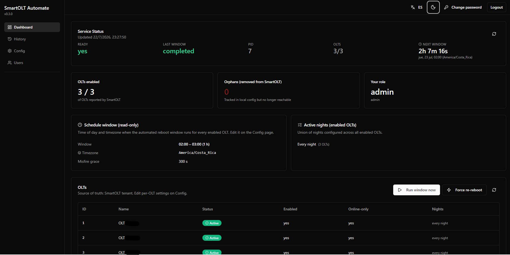

# SmartOLT Automate Installer

> **Idioma**: [English version](docs/README.en.md) · Español (este archivo)

Instalador one-command para [SmartOLT Automate](https://github.com/asotonet/smartolt-automate). El script baja imágenes Docker preconstruidas, genera `.env`, valida la configuración y levanta el stack completo.

Este repo es público y no contiene código fuente de la aplicación — las imágenes vienen de Docker Hub. El código fuente completo está en el [upstream project](https://github.com/asotonet/smartolt-automate).

<p align="center">
  
</p>

## Quick start

```bash
git clone https://github.com/asotonet/smartolt-automate-installer
cd smartolt-automate-installer
cp .env.example .env
$EDITOR .env          # configurar SMARTOLT_DEPLOY_PROFILE, dominio (si aplica), password admin
./smartolt.sh install --yes
```

El primer run imprime el password admin auto-generado al final (si no seteaste `INITIAL_ADMIN_PASSWORD` en `.env`). Guardalo antes de cerrar la shell.

Después del install:

- `./smartolt.sh status` — estado de los contenedores
- `./smartolt.sh logs` — tail de logs de todos los servicios
- `./smartolt.sh deploy` — re-aplicar cambios después de editar `.env` (image pins, profile, domain, ventana del scheduler)
- `./smartolt.sh destroy` — borrar todo lo que el installer creó

## Deploy profiles

La única perilla es `SMARTOLT_DEPLOY_PROFILE` en `.env`. Controla tres cosas: cómo se expone el frontend, si Traefik corre, y de dónde viene el HTTPS.

| Profile | Frontend en host | Traefik | HTTPS | Cuándo usarlo |
|---|---|---|---|---|
| `lan` (default) | `:8080` en `0.0.0.0` | **no corre** | ninguno | Testing en LAN, sin HTTPS |
| `https-public` | loopback `:8080` | corre, enruta por labels | Let's Encrypt vía ACME HTTP-01 | Producción con dominio público |
| `https-behind-external-proxy` | loopback `:8080` | **no corre** | manejado por tu proxy externo | Cloudflare Tunnel / Caddy / nginx delante del host |
| `frontend-only` | `:8080` en `0.0.0.0` | **no corre** | ninguno | Mínimo footprint; LAN only, sin HTTPS |

Si `SMARTOLT_DEPLOY_PROFILE` está vacío en `.env`, el wizard infiere: `SMARTOLT_PUBLIC_DOMAIN` seteado → `https-public`, vacío → `lan`.

El wizard hace el resto. Ver [`.env.example`](.env.example) para la lista completa de variables.

Para `https-behind-external-proxy`, apuntá tu proxy externo a `http://127.0.0.1:8080`:

```caddyfile
# /etc/caddy/Caddyfile
panel.example.com {
    reverse_proxy 127.0.0.1:8080
}
```

## Cambiar el profile después del install

Editá `SMARTOLT_DEPLOY_PROFILE` en `.env` y corré `./smartolt.sh deploy`. El deploy maneja automáticamente la transición entre profiles: si existía un container Traefik de un profile anterior y el nuevo lo excluye, el deploy lo borra primero para que no quede un Traefik huérfano corriendo en `:80`/`:443`.

## Qué hace el script

`./smartolt.sh install --yes` ejecuta el wizard (o skip prompts en non-interactive mode):

1. Verifica que `docker` + `docker compose` estén disponibles.
2. Bootstrap de `.env` desde `.env.example` si falta.
3. Pregunta (o infiere) el deploy profile.
4. Pregunta credenciales admin y el SmartOLT tenant URL/key (o los lee del env).
5. Pregunta la ventana del scheduler (timezone + rango horario).
6. Si el profile necesita HTTPS, pregunta el dominio público y el email ACME.
7. Valida cada variable requerida del profile (con tipo, descripción y ejemplo copy-paste para vars faltantes o mal formadas).
8. Escribe `.env`, corre `docker compose pull` + `up -d`, y prueba el healthcheck.

El wizard re-pregunta el profile con confirmación + retry si tipeás mal — no más typos silenciosos que caen en el modo equivocado.

## Operación del día a día

```bash
./smartolt.sh status         # estado de contenedores + profile + healthcheck URLs
./smartolt.sh logs           # tail de todos los servicios
./smartolt.sh logs web       # tail de un servicio
./smartolt.sh deploy         # re-aplicar después de editar .env
./smartolt.sh upgrade        # bajar imágenes nuevas a la versión de .env
./smartolt.sh upgrade v0.5.0 # upgrade a un tag específico
./smartolt.sh destroy -y     # borrar todo lo que el installer creó
```

Flags comunes:

- `-y, / --yes` — skip de prompts de confirmación (`install`, `destroy`, `upgrade`)
- `--dry-run` — muestra el plan sin cambiar nada
- `--keep-images` / `--keep-data` (`destroy` solo)

## Configuración

Todo vive en `.env`. Editá y corré `./smartolt.sh deploy` para aplicar.

El installer respeta cualquier pin de imagen que pongas en `.env` (ej. `PROXY_IMAGE=asoton/smartolt-automate-traefik:v0.4.10-traefik-fix`) entre re-installs — el wizard no lo sobreescribe con el tag default.

Para knobs avanzados (batching, JWT, internal API token, etc.) el wizard escribe defaults razonables. Override por host vía un `docker-compose.override.yml` montado encima del servicio que corresponda.

## Requisitos

- Docker Engine 24+ con Compose v2
- 1 vCPU + 512 MB RAM disponibles
- Salida HTTPS (puerto 443) a `registry-1.docker.io`
- Para HTTPS: puertos 80 y 443 libres en el host, un dominio con un `A`/`AAAA` apuntando al server

## Troubleshooting

| Síntoma | Causa | Fix |
|---|---|---|
| `Profile '<name>' requires the following vars in .env that are missing or empty:` seguido de un bloque por variable | El profile activo necesita vars que están vacías o mal formadas en `.env`. El validador lista todas las vars faltantes en un solo run con su tipo, descripción y ejemplo copy-paste. | Editá `.env` y seteá las vars listadas, después `./smartolt.sh deploy`. El validador detecta: valores vacíos, el sentinel `change-me-now` del password, FQDNs sin punto o con espacios, emails sin `@` o `.`, imágenes sin `:tag`, passwords con menos de 8 caracteres. |
| Traefik loguea `client version 1.24 is too old` en Ubuntu 24.04+ / Docker Engine 29+ | El Traefik en `:v0.4.9` tiene un cliente Docker pineado a API v1.24, que el daemon moderno rechaza. | Pinear `PROXY_IMAGE=asoton/smartolt-automate-traefik:latest` en `.env` y `./smartolt.sh deploy`. El tag `:latest` trae Traefik 3.7+, que negocia una versión moderna de API. |
| El scheduler corre a la hora equivocada después del install | El wizard escribe `SCHEDULER_TIMEZONE` en `.env`, pero el core scheduler en realidad lee su timezone del `configs/global.yaml` bind-mounted. | Editá `configs/global.yaml` para que matchee `SCHEDULER_TIMEZONE`. El core hot-reloada en ~2s. |
| Cambié `SMARTOLT_DEPLOY_PROFILE` pero el container Traefik sigue corriendo | (Solo versiones viejas — el deploy actual maneja esto automáticamente borrando el Traefik huérfano antes del nuevo `up`.) | Corré `./smartolt.sh deploy` — el deploy detecta la transición entre profiles. |
| `docker compose pull` reporta `not found` para un tag que existe en Docker Hub | Cache stale del registry. | Esperá 5–10 minutos y reintentar, o bajalo manualmente (`docker pull asoton/smartolt-automate-traefik:latest`) antes de `./smartolt.sh deploy`. |
| El container Traefik muestra `unhealthy` en Windows + Docker Desktop | El `docker` provider de Traefik no puede leer el named pipe de Windows. | Esperado en Windows. Usá `http://localhost:8080/` con `EXPOSE_FRONTEND_DIRECTLY=true` (el profile `lan` o `frontend-only`) para acceder a la UI directamente. |

## Publicar un release

Solo maintainers. `scripts/release.sh` baja las 3 imágenes de Docker Hub, las retaguea como `:latest` y las pushea:

```bash
./scripts/release.sh                    # tag desde .env
./scripts/release.sh v0.5.0            # tag explícito
./scripts/release.sh v0.5.0 --skip-pull  # usar cache local
./scripts/release.sh --check           # verificar que un tag esté live (no push)
```

Login en `~/.docker/config.json`. Override con `DOCKERHUB_NAMESPACE=...`.

## Links

- [Upstream project](https://github.com/asotonet/smartolt-automate) — código fuente completo
- [SmartOLT API docs](https://smartolt.com/api-docs) (requiere login)
- [README en inglés](docs/README.en.md)

## Licencia

MIT — ver [LICENSE](./LICENSE).
